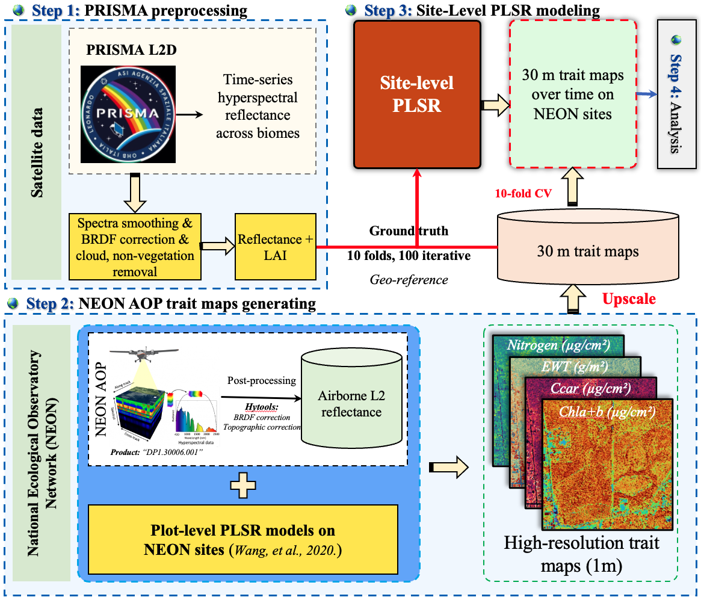

# Tracking seasonal variability in plant traits from PRISMA spaceborne hyperspectral imaging spectroscopy across forest types and ecoregions

## Summary
* Plant traits serve as critical indicators of how plants adapt to environmental changes and influence ecosystem functions. While airborne hyperspectral remote sensing effectively maps plant traits through detailed reflectance properties, it is limited by cost and scale, making large-scale and temporal studies challenging. The recently launched spaceborne hyperspectral imagers, such as PRISMA, offer frequent and high-quality measurements, making them suitable for large-scale trait mapping. However, their potential remains largely unexplored. 
* This study developed a multi-stage framework by leveraging the PRISMA data and NEON AOP hyperspectral data to investigate the seasonal dynamics of four key plant traits — chlorophyll (Chla+b, µg/cm<sup>2</sup>), carotenoids (µg/cm<sup>2</sup>)), leaf water (g/m<sup>2</sup>), and nitrogen content (µg/cm<sup>2</sup>) — across eleven NEON sites representing diverse forest types in the contiguous U.S.
* **Research Questions:**
  * **_(1) What are the capabilities of the PRISMA data in quantifying seasonal variations of plant traits at large scales?_**
  * **_(2) How do plant traits vary within the growing season for different forest types and ecoregions, using NEON sites as a representative example?_** 
  * **_(3) What factors control the spatial and seasonal variability of plant traits?_**
* **Conclusions:**
  * Our results demonstrated that PRISMA hyperspectral data can reliably track seasonal variability in plant traits, achieving overall R<sup>2</sup> values ranging from 0.78 to 0.88 and _NRMSE_ values ranging from 5.4% to 8.4% for the four traits. 
  * Seasonal patterns revealed bell-shaped trajectories for chlorophyll and carotenoids, while leaf water content decreased steadily across most sites. Nitrogen content exhibited less pronounced seasonal variation. 
  * Analysis of environmental drivers showed that seasonal variability is primarily controlled by solar radiation and day length in northern sites, vapor pressure in semi-arid regions, and temperature in mid-southeastern sites. 
  * Spatial variability was primarily driven by soil properties, particularly during the peak growing season. However, the influence of soil variables slightly declines toward the end of the season at several sites, as climatic factors become more prominent. 
* This study highlights the capability of PRISMA spaceborne hyperspectral data for large-scale, time-series plant trait mapping and provides valuable insights into the interactions between plant traits and environmental factors.

## Seasonal plant traits modeling across diverse forest types and NEON sites

<p align="center"><b>Fig.1.</b> Summarized workflow for tracking seasonal variability of plant traits.</p>

## Requirements
* Python 3.8.18 and R 4.3.2,  more in `python_environment.yml` and `R_environment.txt`

### Usage

* <span style="font-size:20px; color:blue;">**Clone this repository and set environment**</span>

  ```
  git clone https://github.com/FujiangJi/PRISMA_seasonal_traits.git
  conda env create -f python_environment.yml
  conda activate seasonal_traits_env
  ```
* <span style="font-size:20px; color:blue;">**Data Preparation**</span>
  * **_PRISMA spaceborne hyperspectral imaging spectroscopy._**
    * [Data portal](https://prisma.asi.it/), L2D level data downloaded.
    * PRISMA: Push broom imaging spectrometer with **240 spectral bands** from **400 to 2500 nm**, spatial and spectral resolution of **30 m** and **~10 nm**, swath width of **30 km** and revisit time of **29 days**;
    * **Sensors:** A <u>visible/near-infrared sensor</u> (66 bands, 400-1010 nm), a <u>shortwave infrared sensor</u> (173 bands, 920-2500 nm), and a <u>panchromatic sensor</u> with a spatial resolution of 5 m.
  
  * **_National Ecological Observational Network (NEON) Airborne Observation Platform (AOP) hyperspectral data._**
    * Product: [DP3.30006.001](https://data.neonscience.org/data-products/DP1.30006.001).
    * NEON AOP imaging spectrometer is a passive instrument featuring **426 spectral bands** from **380 to 2510 nm** with a spatial and spectral resolution of **1m** and **~5nm**.

  * **_MODIS vegetation and biophysical products._**
    * [MOD13A1](https://developers.google.com/earth-engine/datasets/catalog/MODIS_061_MOD13A1): Terra Vegetation Indices 16-Day Global 500m ([GEE code](https://code.earthengine.google.com/ba9b3b1b4af5af63cb396da833cfe5ed)).
    * [MOD15A2H](https://developers.google.com/earth-engine/datasets/catalog/MODIS_061_MOD15A2H): Terra Leaf Area Index/FPAR 8-Day Global 500m ([GEE code](https://code.earthengine.google.com/ba9b3b1b4af5af63cb396da833cfe5ed)).
    * [MCD43A1](https://developers.google.com/earth-engine/datasets/catalog/MODIS_061_MCD43A1): MODIS BRDF-Albedo Model Parameters Daily 500m ([GEE code](https://code.earthengine.google.com/e5264f6522ce2333130232d97499c5c9)).
 
  * **_Global land cover data._**
    * The land cover data from the global fine-classified land cover product “GLC_FCS30D” ([Zhang et al., 2024](https://essd.copernicus.org/articles/16/1353/2024/)), containing 35 land-cover subcategories and covering the period from 1985 to 2022. 
    * Process the land cover data, run code `1_land_cover_data_processing.ipynb` in the directory `0_data_preparation`

  * **_Environmental data._**
    * **Climate forcing data:** [Daymet](https://daac.ornl.gov/cgi-bin/dsviewer.pl?ds_id=2129), Daily Surface Weather Data on a 1-km Grid for North America. Key variables included <u>minimum temperature</u>, <u>maximum temperature</u>, <u>precipitation</u>, <u>shortwave radiation</u>, <u>vapor pressure</u> and <u>day length</u>, etc.
    * **Soil data:** Soil properties were obtained from two datasets: [SoilGrids 250m v2.0](https://gee-community-catalog.org/projects/isric/) and the [POLARIS](https://gee-community-catalog.org/projects/polaris/) soil properties dataset. We incorporated 14 soil properties in total and focused on the top layer of 0-5 cm ([GEE code](https://code.earthengine.google.com/c1379f40cb8cc647c1f715af0390c5ef)). 
    * **Topographic data:** <u>elevation</u>, <u>slope</u>, and <u>aspect</u>, were extracted from the Shuttle Radar Topography Mission ([SRTM](https://developers.google.com/earth-engine/datasets/catalog/CGIAR_SRTM90_V4)) digital elevation dataset at a spatial resolution of 90 m ([GEE code](https://code.earthengine.google.com/b898b85c6133e1177908c227de211db9)). 
    * Process the environmental data, run code `2_forcing_data_processing.ipynb`, `3_soil_data_processing.ipynb`, `4_topographic_data_processing.ipynb` in the directory `0_data_preparation`, respectively.

* <span style="font-size:20px; color:blue;">**Step 1: PRISMA data preprocessing.**</span>
  
  _Navigate to the directory **`1_Step1_PRISMA_preprocessing`** and execute the code in the following steps after updating the input/output paths:_
  * **_Convert original PRISMA data to GeoTIFF:_** employed the [prismaread](https://github.com/irea-cnr-mi/prismaread/) package.
    ```
    Rscript 1_convert_PRISMA_to_geotiff.R
    ```
  * **_Smooth PRISMA spectra:_** Artifacts associated with the instrument, atmospheric gaseous absorption, and other factors were systematically excluded.
    ```
    python 2_convert_geotiff_to_array.py
    ```
    ```
    Rscript 3_smooth_PRISMA_imagery.R
    ```
  * **_BRDF correction:_** Substantial changes in geometry occur throughout the growing season in PRISMA data, followed the Ross-Li kernel functions and c-factors method. Run the code `4_BRDF_correction.ipynb`
  * **_PRISMA LAI estimation:_** run the code `5_MODIS_LAI_VI_models.ipynb` for building the LAI ~ VI relationshpis, run `6_Calculate_PRISMA_VI_LAI.ipynb` for getting the PRISMA-derived LAI, and run code `7_cloud_mask.ipynb` to obtain the cloud mask data.

* <span style="font-size:20px; color:blue;">**Step 2: NEON AOP trait maps generating.**</span>  

  _Navigate to the directory **`2_Step2_NEON_AOP_trait_mapping`** and execute the code in the following steps after updating the input/output paths. **Note:** This step must be performed on a Linux OS, preferably in a high-performance computing (HPC) cluster._

  * **_Set the environment and get the plot-level trait models:_** get the running [environment](https://drive.google.com/file/d/1OuE3DSlr0neIPr98qYOxjYMrZN-8-pTw/view?usp=sharing) and [trait models](https://drive.google.com/file/d/1KZ40zccJDsJIc69kqQRGpLzXNJuZ-6kE/view?usp=sharing), the unzipped environment put in directory `pyenvs` and the zipped trait models put in folder `trait_models`
  * **_High resolution NEON AOP trait maps (1m):_** this step include: (1) data pull from [NEON]((https://data.neonscience.org/data-products/DP1.30006.001)); (2) Topographic and BRDF correction based on [HyTools](https://github.com/EnSpec/hytools) package; (3) High-resolution trait prediction.
    ```
    sbatch 1_NEON_AOP_scripts.sh Flightline
    (i.e., sbatch 1_NEON_AOP_scripts.sh NEON_2021_D14_JORN_20210909)
    ```
  * **_Mosaic the flightline trait maps:_**
    ```
    sbatch 2_NEON_AOP_mosaic.sh Flightline
    ```
  * **_Clip the mosaiced trait maps:_**
      ```
      python 3_clip.py
      ```
  * **_Upscale the trait maps:_** upscaled to the resolution of PRISMA data (30m) 
    ```
    python 4_upscaling.py
    ```

* <span style="font-size:20px; color:blue;">**Step 3: Site-level PLSR modeling.**</span>  

  _Navigate to the directory **`3_Step3_Site_level_PLSR_modeling`** and execute the code in the following steps after updating the input/output paths:_
  * **_Extract training data:_** extract the calibration and validation datasets from PRISMA reflectance, LAI and upscaled 30 m NEON AOP trait maps by running code `1_extract_training_data.ipynb. **_Note:_** a minimum distance of 100m was maintained between the randomly selected points to minimize spatial autocorrelation.
  * **_Site-level PLSR modeling:_**
    ```
    python 2_site_level_PLSR_training.py
    ```
  * **_Predict PRISMA traits:_**
    ```
    python 3_predict_PRISMA_traits.py
    ```
  * **_Calibrated models:_** The trained site-level models can be find in directory **`site-level_PLSR_models`**
  * **_Coefficients:_** The PLSR coefficients, VIP metrics and PRESS scores can be found in directory **`coefficients`**


* <span style="font-size:20px; color:blue;">**Step 4: Statistical analysis of seasonal variability in plant traits and its drivers.**</span>

  _Navigate to the directory **`4_Step4_statistical_analysis`** and execute the code in the following steps after updating the input/output paths:_
  * **_Seasonal variability in plant traits across forest types and NEON sites:_** execute the code `1_seasonal_variability_statistical.ipynb`
  * **_Drivers for seasonal and spatial variation of plant traits:_** execute the code `2_seasonal_spatial_variability_drivers.ipynb`

## Reference
In case you use our framework and code in your research, Please cite our paper:
* If you have any questions, please feel free to reach me at fujiang.ji@wisc.edu.
  ```
  Ji,F.; Zheng, T.; Yang, R.; Kovach, K. R.; Townsend, P. A.; Shiklomanov, A. N.; Li, F.; Hao, D.; Dashti, H.; You, H.; Zhou, J.;
  Chen, M. Tracking seasonal variability in plant traits from PRISMA spaceborne hyperspectral imaging spectroscopy over diverse
  forest types and ecological functional regions. 2025. (Manuscript submitted, DOI forthcoming).
  ```

## Contact
```
fujiang.ji@wisc.edu
min.chen@wisc.edu
```
## Credits
* This study is supported by the National Aeronautics and Space Administration (NASA) through Remote Sensing Theory, Commercial SmallSat Data Scientific Analysis (CSDSA).
* We acknowledge the NEON team for providing the airborne hyperspectral data and the Townsend lab for providing the workflow in processing the airborne data.
* We acknowledge high-performance computing support from the UW-Madison Center for High Throughput Computing (CHTC) in the Department of Computer Sciences. 
